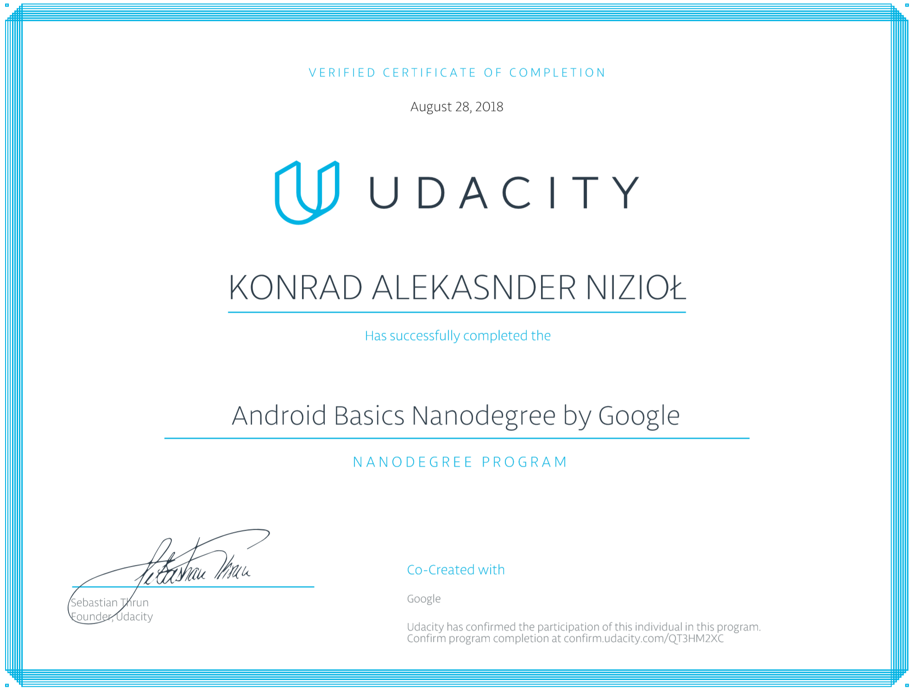
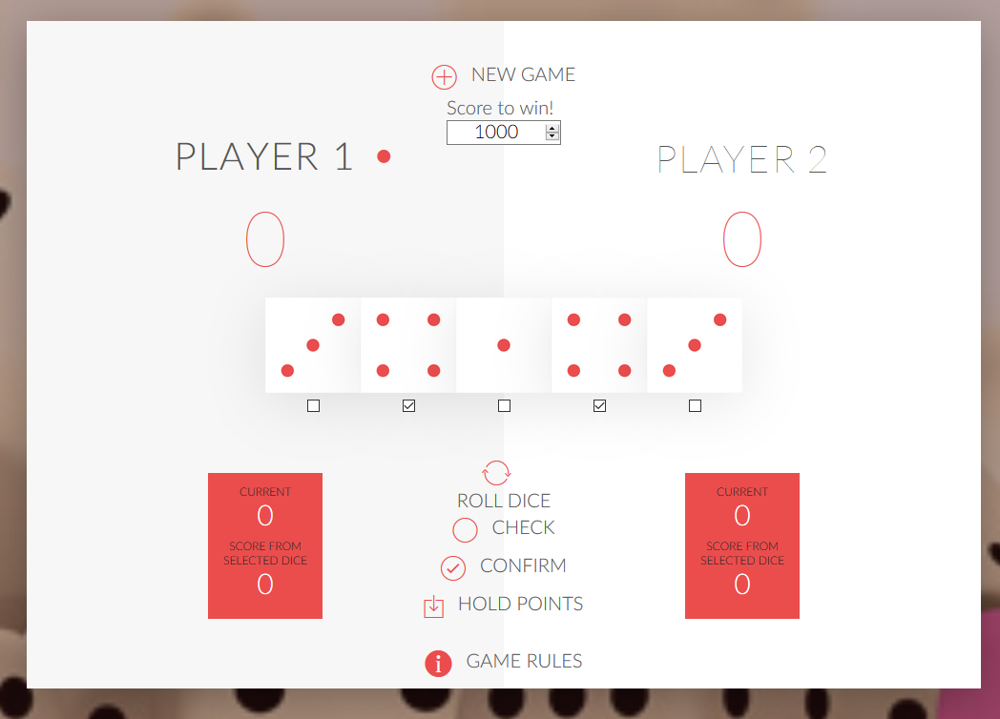

# history-first-steps
Projects from the time I started to learn how to program. All in java but there is also an interesting browser game written in javascript and a page in html5/css3/js.

## Strumienie-Java-Cars

Design of a mini car showroom consisting of a list of cars to buy. Program created within the framework of learning Java and Git

Zagadnienia, które zostały użyte do wykonania zadania:
* Composition
* Lambda
* Collectiond
* Map
* stream Java 8.

## Google Developer Challenge Scholarship / Android Basics
"We are excited to offer you a Google Developer Challenge Scholarship to the Android Basics track."
 
 
## website-for-sister
To learn the basics HTML/CSS3/JS, I create a website for my sister. She is passionate about photography.

## dice-game
Dice game created for practice DOM manipulation.  (JavaScript)

## Console program

* Connection to a database (SQLite)
* Save data from/to the database (crud)
* Presentation of data (in consil)
* Error handling for incorrect data entry
* Advanced position search options
* Documentation

